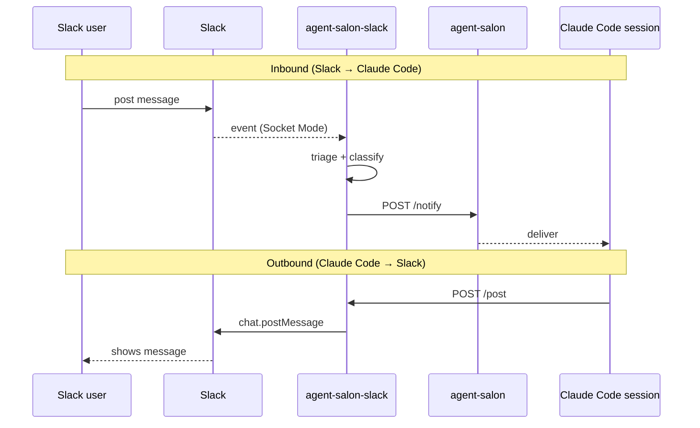

# agent-salon-slack

A bridge between Slack and Claude Code sessions.

- **Slack inbound**: subscribes to `message.channels` / `message.groups` over Socket Mode, triages, and forwards to agent-salon.
- **Slack outbound**: accepts post requests on `POST /post` (localhost) and posts to Slack with the bot token.

The "thinking" happens in the Claude Code session. agent-salon-slack is just plumbing.

## Installation

### 1. Create the Slack app

<https://api.slack.com/apps> → **Create New App** → **From a manifest** → paste `manifest.yml` and install to your workspace.

### 2. App-level token

`Basic Information` → `App-Level Tokens` → issue a token with `connections:write`. Put the resulting `xapp-...` into `SLACK_APP_TOKEN`.

### 3. Bot user OAuth token

`Install App` → `Install to Workspace` issues an `xoxb-...` token. Put it into `SLACK_BOT_TOKEN`.

### 4. agent-salon URL and labels

- `AGENT_SALON_URL`: full URL up to `/notify`.
- `AGENT_SALON_LABEL`: this service's own label (e.g. `agent-salon-slack`).
- `AGENT_SALON_TARGET`: label of the Claude Code session that should receive notifications.

### 5. Prepare .env and run

```sh
cp .env.example .env
# edit .env
set -a; source .env; set +a
cargo run
```

### Environment variables

| Name | Required | Purpose |
|---|---|---|
| `SLACK_APP_TOKEN` | ✅ | Socket Mode connection (`xapp-...`) |
| `SLACK_BOT_TOKEN` | ✅ | Web API calls (`xoxb-...`) |
| `AGENT_SALON_URL` | ✅ | agent-salon `/notify` URL |
| `AGENT_SALON_LABEL` | ✅ | This service's own label |
| `AGENT_SALON_TARGET` | ✅ | Label of the receiving session |
| `AGENT_SALON_SLACK_HTTP_PORT` | - | Default `8765` |
| `AGENT_SALON_SLACK_HTTP_BIND` | - | Default `127.0.0.1`. Address to bind the `/post` listener to. Set to a Tailscale IP (or `0.0.0.0` if the network is already gated) to accept requests from other hosts. **`/post` is unauthenticated**, so anyone who can reach the port can post to Slack — keep the listener behind a trusted network. |
| `OLLAMA_URL` | - | Default `http://localhost:11434` |
| `OLLAMA_MODEL` | - | Default `llama-guard3:1b` |
| `INJECTION_BLOCK_THRESHOLD` | - | Default `0.7`. Block at or above this score. |
| `INJECTION_WARN_THRESHOLD` | - | Default `0.5`. Add suspicious annotation at or above this score. |
| `INJECTION_TIMEOUT_SECS` | - | Default `30`. Timeout for Ollama / claude -p. |
| `AGENT_SALON_SLACK_CONFIG` | - | Optional path to a `KEY=VALUE` config file. Lines starting with `#` and blank lines are ignored. The live process environment overrides any value from the file. Used by the Homebrew formula to point at `${HOMEBREW_PREFIX}/etc/agent-salon-slack.conf`. |
| `RUST_LOG` | - | e.g. `agent_salon_slack=debug` |

## Architecture



## Wire format

JSON Schemas live in [`docs/`](docs/).

### `POST /post` — Claude Code session → agent-salon-slack

| | |
|---|---|
| URL | `http://127.0.0.1:{AGENT_SALON_SLACK_HTTP_PORT}/post` |
| Body | [`docs/post-request.json`](docs/post-request.json) |
| Response | `200 OK` on success; `500` with the error string on failure |

### `POST /notify` — agent-salon-slack → agent-salon

| | |
|---|---|
| URL | `{AGENT_SALON_URL}?label={AGENT_SALON_LABEL}` |
| Body | [`docs/envelope.json`](docs/envelope.json) |

The `content` field of the envelope is a JSON-encoded
[`SlackEvent`](docs/slack-event.json). `safety` is null unless the warn
threshold is crossed.

## Prompt-injection detection

For messages that pass triage, agent-salon-slack runs a **local LLM injection
classifier on Ollama** before forwarding to agent-salon. Detection runs on
the Rust side so the receiving Claude Code session's context is never
contaminated with the suspect text.

### Flow

1. **Primary**: send the text to Ollama (`llama-guard3:1b`) for `safe` / `unsafe` classification.
2. **Fallback**: if Ollama is unreachable, spawn a `claude -p` subprocess to obtain a continuous score.
3. The score maps to one of three behaviors:

| Score | Behavior |
|---|---|
| `< INJECTION_WARN_THRESHOLD` (default 0.5) | Forward to agent-salon, `safety` is null. |
| `INJECTION_WARN_THRESHOLD ≤ score < INJECTION_BLOCK_THRESHOLD` (0.5–0.7) | Forward to agent-salon with a `safety` field (suspicious annotation). |
| `≥ INJECTION_BLOCK_THRESHOLD` (default 0.7) | **Drop**. Post an alert in the originating thread, emit a structured `kind=slack.message_blocked` log line (see [Logging](#logging)), and do not forward to agent-salon. |

### Ollama setup

```sh
# Ollama itself: https://ollama.com/download
ollama pull llama-guard3:1b
ollama serve   # defaults to localhost:11434
```

Override with `OLLAMA_URL` / `OLLAMA_MODEL` if needed.

## Logging

All logs are written to stdout as JSON Lines (one JSON object per line) via
`tracing_subscriber::fmt().json().flatten_event(true)`. Filter with
`RUST_LOG`.

Every line carries a `kind` discriminator. The full set of kinds and their
fields is the stable contract — see
[`docs/log-line.json`](docs/log-line.json). Panics, startup failures, and
unexpected task termination are routed through tracing as well, so the
JSONL stream is the single source of truth.

Filter quarantine (blocked-injection) events with `jq`:

```sh
agent-salon-slack 2>&1 | jq -c 'select(.kind == "slack.message_blocked")'
```

## Triage (what agent-salon-slack drops)

Subtype whitelist. **Forwarded**:

- No `subtype` (regular human post)
- `bot_message` — posts from other bots (New Relic alerts, CodeRabbit, etc.)
- `thread_broadcast` — broadcast from a thread to its channel
- `file_share` — post with file attachment
- `me_message` — `/me` command

**Dropped**:

- Any other `subtype` (system/edit events such as `message_changed` /
  `message_deleted` / `channel_join` / `channel_topic` / `pinned_item` /
  `huddle_thread`)
- `hidden = true`
- **Posts from this bot itself** — senders whose `bot_id` matches the value
  obtained via `auth.test` at startup are dropped (loop prevention).
- Empty body / no sender identifier (neither `user` nor `bot_id`)
